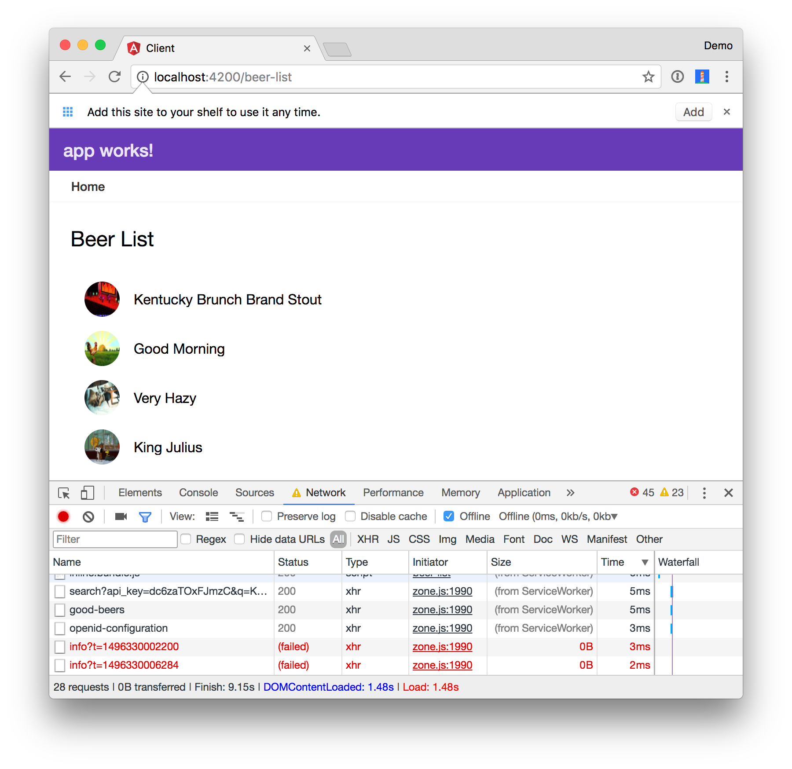

# Spring Boot API with Angular PWA
 
This is an example app that shows how to create a Spring Boot API and display its data with an Angular PWA that works offline.

To see how this application was created, please read [Build Your First Progressive Web Application with Angular and Spring Boot](http://developer.okta.com/blog/2017/05/09/progressive-web-applications-with-angular-and-spring-boot) on the Okta developer blog.

To run the server, cd into the `server` folder and run `mvn spring-boot:run`.

To run the client, cd into the `client` folder and run `npm install && ng serve`. Open <http://localhost:4200> to load initial data. Use Chrome Developer Tools to toggle offline status in the Network tab to prove that it works offline.

